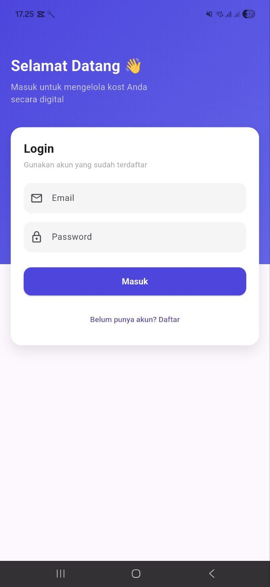
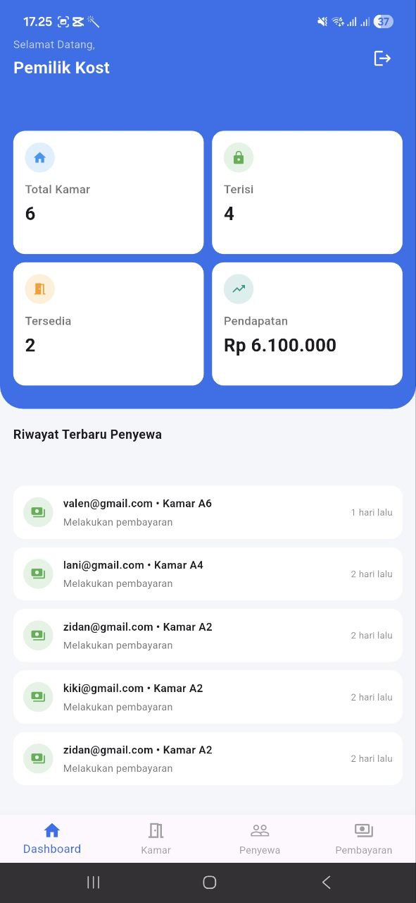
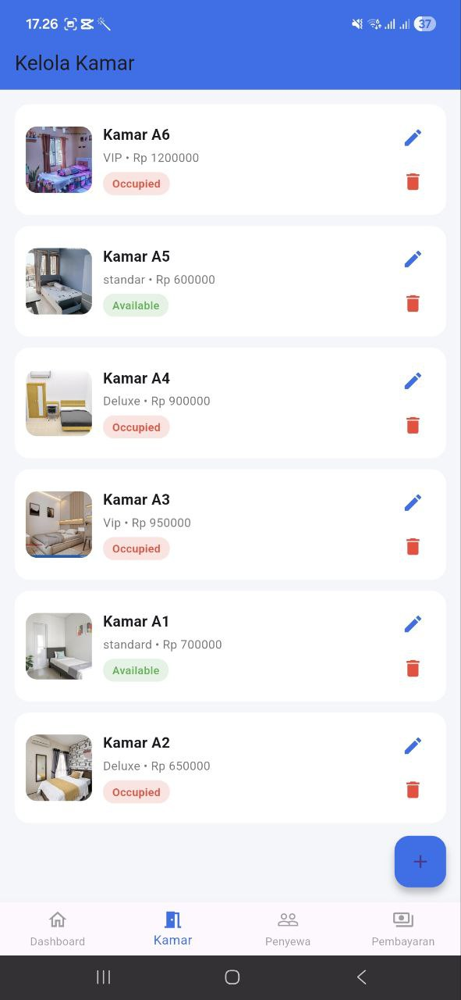
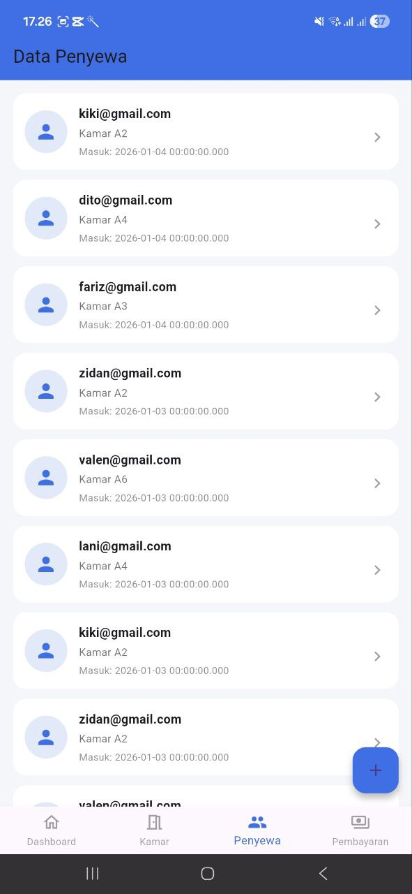
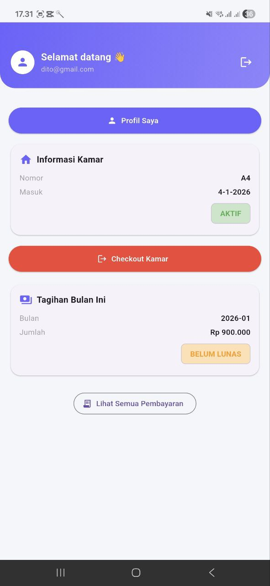
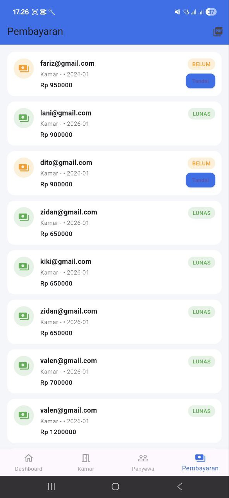
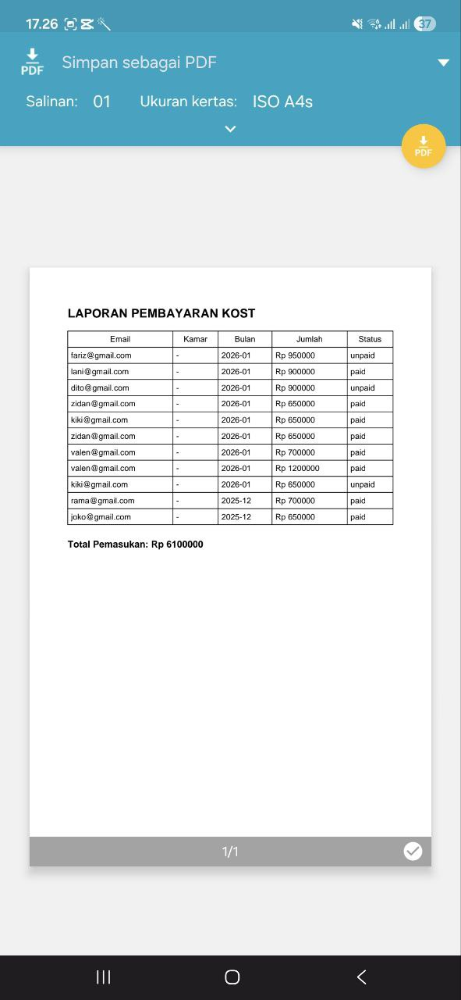
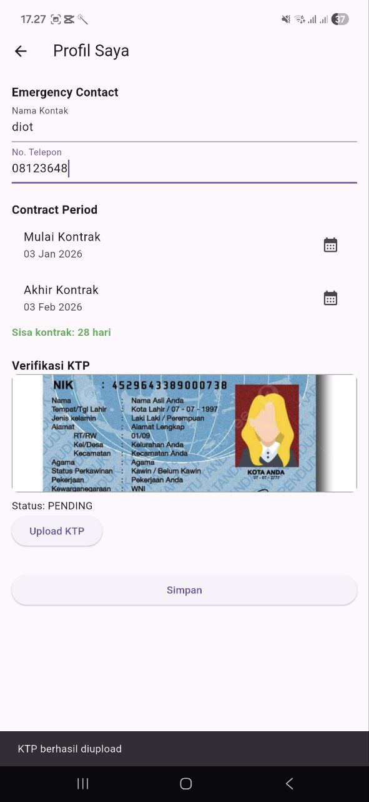

# KostKu – Aplikasi Manajemen Kost (Flutter + Supabase)

KostKu adalah aplikasi mobile berbasis Flutter yang digunakan untuk membantu
pemilik kost dan penyewa dalam mengelola kamar, data penyewa, serta pembayaran
secara digital dan terpusat.

Aplikasi ini memiliki dua role utama:
- **Owner (Pemilik Kost)**
- **Tenant (Penyewa Kost)**

Backend aplikasi menggunakan **Supabase** (Authentication, Database, Storage).

---

## 🚀 Fitur Aplikasi

### 👤 Owner (Pemilik Kost)
- Login & Logout
- Dashboard statistik:
  - Total kamar
  - Kamar terisi
  - Kamar tersedia
  - Total pendapatan
- Kelola kamar (Tambah, Edit, Hapus + Foto)
- Kelola data penyewa
- Checkout penyewa
- Kelola pembayaran
- Export laporan pembayaran ke PDF

### 🧑 Tenant (Penyewa)
- Login & Logout
- Dashboard penyewa
- Melihat informasi kamar
- Melihat tagihan bulanan
- Upload bukti pembayaran
- Riwayat pembayaran
- Checkout kamar & pesan ulang kamar

---

## 🖼️ Screenshot Demo (Minimal 5)

1. Halaman Login  
2. Dashboard Owner  
3. Kelola Kamar  
4. Dashboard Tenant  
5. Halaman Pembayaran  

📌 Screenshot aplikasi dapat dilihat pada folder `/screenshots` atau di-embed di README.

---

## 📦 File APK / AAB

🔗 **Link APK untuk Testing:**  
👉 **(https://drive.google.com/file/d/1rdKdZtNKfwIeKmulNLhYvuCXkxi231MR/view?usp=drive_link)**


---

## ▶️ Cara Menjalankan Aplikasi

### 1️⃣ Clone Repository
```bash
git clone https://github.com/surya07-web/project_capstone-kostku.git

cd kostku

#install dependency:
flutter pub get

#Jalankan Aplikasi
flutter run

## 🖼️ Screenshot Demo Aplikasi

### 🔐 Halaman Login


### 🧑‍💼 Dashboard Owner


### 🏠 Kelola Kamar (Owner)


### 👥 Data Penyewa


### 🧑 Dashboard Tenant


### 💳 Pembayaran (Owner)


### 📄 Export Laporan PDF


### 💸 Riwayat Pembayaran Tenant


### 🪪 Upload KTP Tenant

